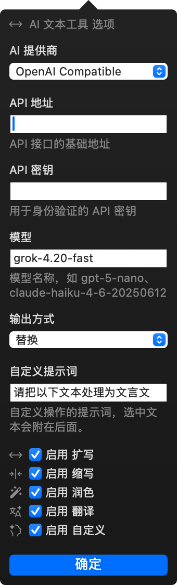

# AI Text Tools for PopClip

[中文](#中文) | [English](#english)

---

## English

A PopClip extension that integrates AI capabilities, providing text expand, shorten, polish, translate, and custom prompt actions. Supports both OpenAI-compatible and Claude APIs.

### Features

| Button | Action | Description |
|--------|--------|-------------|
| Expand | Text expansion | Enrich details while preserving the original meaning |
| Shorten | Text shortening | Keep core information, remove redundancy |
| Polish | Text polishing | Improve fluency, fix grammar and wording |
| Translate | Translation | Auto-detect: CN→EN, EN→CN, others→CN |
| Custom | Custom prompt | Process text with your own prompt |

### Installation

1. Download `ai-text-tools.popclipextz` from the latest [Release](../../releases)
2. Double-click the `.popclipextz` file — PopClip will install it automatically
3. Configure your API settings in PopClip's extension preferences

### Configuration

| Option | Description | Default |
|--------|-------------|---------|
| AI Provider | API provider | `OpenAI Compatible` |
| API Base URL | API endpoint URL | `https://api.openai.com/v1` |
| API Key | Your API key | *(required)* |
| Model | Model name | `gpt-5-nano` |
| Output Mode | Output behavior | `Replace` |
| Custom Prompt | Custom action prompt | `请帮我处理以下文本` |
| Enable Expand | Show/hide Expand button | ✅ |
| Enable Shorten | Show/hide Shorten button | ✅ |
| Enable Polish | Show/hide Polish button | ✅ |
| Enable Translate | Show/hide Translate button | ✅ |
| Enable Custom | Show/hide Custom button | ✅ |

#### OpenAI-compatible API

Works with OpenAI, DeepSeek, Qwen, Groq, and any OpenAI-compatible service:

- Provider: `OpenAI Compatible`
- API Base URL: `https://api.openai.com/v1`
- Model: `gpt-5-nano`

#### Claude API

- Provider: `Claude (Anthropic)`
- API Base URL: `https://api.anthropic.com/v1`
- Model: `claude-haiku-4-6-20250612`

#### Third-party Proxies

Supports any OpenAI-compatible proxy — just change the API Base URL and API Key.

### Output Modes

| Mode | Description |
|------|-------------|
| **Replace** / 替换 | AI result replaces the selected text directly / AI 处理结果直接替换选中的文字 |
| **Copy** / 复制 | Result is copied to clipboard with a confirmation message / 结果复制到剪贴板，显示确认提示 |
| **Copy & Replace** / 复制并替换 | Result is copied to clipboard AND replaces the selected text / 结果复制到剪贴板，同时替换选中文字 |

### Custom Prompt Examples

The Custom action appends your selected text after the prompt. Set your personality, then let it rip.

| Personality | Prompt |
|-------------|--------|
| **Proofreader** — Zero tolerance for typos, grammar sins, and awkward phrasing | `Fix all typos, grammar mistakes, and awkward phrasing. Output only the corrected text:` |
| **CEO** — Corporate polish. Every word earns its place | `Rewrite in a professional, executive tone. Concise and authoritative. Output only the result:` |
| **Bestie** — Warm, casual, like texting your closest friend | `Rewrite in a casual, warm, friendly tone. Like texting a close friend. Output only the result:` |
| **Telescope** — Find the signal, discard the noise | `Summarize in one clear sentence. No fluff. Output only the summary:` |
| **Professor** — Patient explainer, crystal clear | `Explain in simple terms anyone can understand. Use analogies if helpful. Output only the explanation:` |
| **Muse** — Pick up the pen and keep going | `Continue writing from where this text ends. Match the style and tone exactly. Output only the continuation:` |
| **Staccato** — Bullets only. No prose. | `Convert into concise bullet points. No intro, no outro. Output only the bullets:` |
| **Pitch** — Make them say yes | `Rewrite to be more persuasive and compelling. Every sentence should drive action. Output only the result:` |
| **Forensics** — Pull out the facts, nothing but the facts | `Extract all key facts, data points, and claims. Output only the extracted content:` |
| **Hemingway** — Cut the fat. Keep the muscle | `Rewrite using short, direct sentences. Remove adverbs and filler words. Output only the result:` |
| **Diplomat** — Say the hard thing softly | `Rewrite to be tactful and diplomatic. Convey the same message without friction. Output only the result:` |
| **Mic Drop** — One line. Maximum impact | `Condense into a single powerful, memorable line. Output only that line:` |
| **Emoji** — Words are fine, vibes are better | `Rewrite using emoji where they add expression and tone. Output only the result:` |
| **Noir** — Hard-boiled narration, shadows and all | `Rewrite in the style of a noir detective narrating. Moody, cynical, atmospheric. Output only the result:` |
| **Pirate** — Avast! Every sentence needs more seas | `Rewrite like a salty pirate captain. Full of nautical terms and swagger. Output only the result:` |

### Technical Details

- Shell Script + curl for API calls — no additional dependencies needed
- Auto-handles SSE streaming responses (fallback parser for non-compliant APIs)
- Python3 for safe JSON escaping to handle special characters
- Bilingual UI (English / Simplified Chinese) — follows your system language
- Language-aware translation direction (auto-detects CN/EN and translates accordingly)

### Requirements

- macOS 12+
- PopClip 2024.5+
- Python 3 (system built-in)
- jq (optional, for JSON parsing)

---

## 中文

一个 PopClip 扩展，集成 AI 能力，提供文本扩写、缩写、润色、翻译和自定义提示词操作。支持 OpenAI 兼容 API 和 Claude API。

### 功能

| 按钮 | 功能 | 说明 |
|------|------|------|
| 扩写 | 文本扩写 | 保持原意，丰富细节和表达 |
| 缩写 | 文本缩写 | 保留核心信息，去除冗余 |
| 润色 | 文本润色 | 更流畅自然，修正语法和用词 |
| 翻译 | 中英互译 | 自动检测：中→英，英→中，其他→中 |
| 自定义 | 自定义提示词 | 使用自定义 prompt 处理文本 |

### 安装

1. 从最新的 [Release](../../releases) 下载 `ai-text-tools.popclipextz`
2. 双击 `.popclipextz` 文件，PopClip 会自动安装
3. 在 PopClip 设置中配置 API 信息

### 配置

| 选项 | 说明 | 默认值 |
|------|------|--------|
| AI 提供商 | API 提供商 | `OpenAI Compatible` |
| API 地址 | API 接口地址 | `https://api.openai.com/v1` |
| API 密钥 | 你的 API Key | （必填） |
| 模型 | 模型名称 | `gpt-5-nano` |
| 输出方式 | 结果输出行为 | `Replace` |
| 自定义提示词 | 自定义操作的提示词 | `请帮我处理以下文本` |
| 启用 扩写 | 显示/隐藏扩写按钮 | ✅ |
| 启用 缩写 | 显示/隐藏缩写按钮 | ✅ |
| 启用 润色 | 显示/隐藏润色按钮 | ✅ |
| 启用 翻译 | 显示/隐藏翻译按钮 | ✅ |
| 启用 自定义 | 显示/隐藏自定义按钮 | ✅ |

#### OpenAI 兼容 API

适用于 OpenAI、DeepSeek、通义千问、Groq 等：

- 提供商：`OpenAI Compatible`
- API 地址：`https://api.openai.com/v1`
- 模型：`gpt-5-nano`

#### Claude API

- 提供商：`Claude (Anthropic)`
- API 地址：`https://api.anthropic.com/v1`
- 模型：`claude-haiku-4-6-20250612`

#### 第三方代理/中转

支持各种 OpenAI 兼容的中转服务，只需修改 API 地址和 API 密钥即可。

### 输出模式

| 模式 | 说明 |
|------|------|
| **Replace** / 替换 | Replace selected text with AI result / AI 处理结果直接替换选中的文字 |
| **Copy** / 复制 | Copy to clipboard with confirmation / 结果复制到剪贴板，显示确认提示 |
| **Copy & Replace** / 复制并替换 | Copy to clipboard AND replace selected text / 结果复制到剪贴板，同时替换选中文字 |

### 自定义提示词示例

自定义操作会将选中文本附加在提示词后面。设定你的人格，然后开干。

| 人格 | 提示词 |
|------|--------|
| **校对官** —— 对错别字和语病零容忍 | `修正所有错别字、语法错误和拗口表达，只输出修正后的文本：` |
| **霸总** —— 每个字都要有执行力 | `用专业、权威、简洁的商务语气改写，只输出改写结果：` |
| **好闺蜜** —— 温暖随性，像发微信 | `用轻松、亲切、口语化的语气改写，像在跟好朋友聊天，只输出改写结果：` |
| **聚光灯** —— 剥离噪音，只留信号 | `用一句话精炼总结，不加废话，只输出总结：` |
| **老师** —— 通俗易懂，醍醐灌顶 | `用最通俗的语言解释，必要时用比喻，只输出解释内容：` |
| **续写者** —— 提笔续写，一气呵成 | `接着原文继续写，保持相同的风格和语气，只输出续写内容：` |
| **罗列狂** —— 只要要点，不要废话 | `转换为简洁的要点列表，不要开头结尾，只输出列表：` |
| **带货王** —— 每句话都让人想下单 | `改写得更有说服力和感染力，每句话都要推动行动，只输出改写结果：` |
| **侦探** —— 只提取事实，绝不添油加醋 | `提取所有关键事实、数据点和论断，只输出提取的内容：` |
| **海明威** —— 短句直击，删掉一切修饰 | `用简短有力的句子改写，删除副词和废话，只输出改写结果：` |
| **外交官** —— 把难听的话说得漂亮 | `用委婉得体的方式改写，传达同样意思但避免冲突，只输出改写结果：` |
| **金句王** —— 一句话，一击即中 | `浓缩成一句有力、令人难忘的话，只输出这句话：` |
| **颜文字** —— 能用表情说明的绝不用字 | `在合适的地方用 emoji 替代文字来增加表现力，只输出改写结果：` |
| **武侠** —— 飞沙走石，字字如刀 | `用武侠小说的风格改写，江湖气拉满，只输出改写结果：` |
| **甄嬛** —— 话里有话，绵里藏针 | `用宫廷剧的语气改写，字字机锋，句句试探，只输出改写结果：` |

### 技术细节

- 使用 Shell Script + curl 调用 API，无需额外依赖
- 自动兼容 SSE 流式响应（某些 API 忽略 `stream:false` 时自动回退解析）
- Python3 用于安全的 JSON 转义，防止特殊字符问题
- 双语界面（英文 / 简体中文）——跟随系统语言自动切换
- 翻译自动检测语言方向（中→英 / 英→中）

### 系统要求

- macOS 12+
- PopClip 2024.5+
- Python 3（系统自带）
- jq（可选，用于 JSON 解析）

## Credits

- **Author:** [ma200line](https://x.com/ma200line)
- **Icons:** [Central Icons](https://centralicons.com)

## License

MIT
